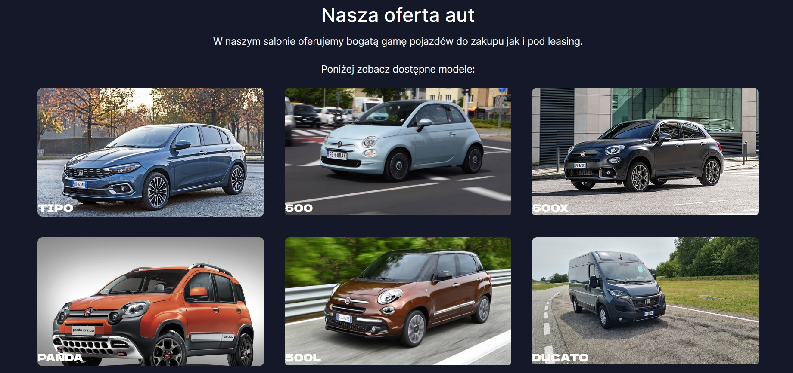
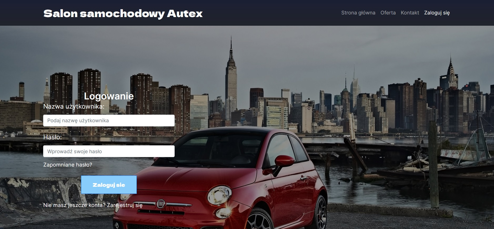
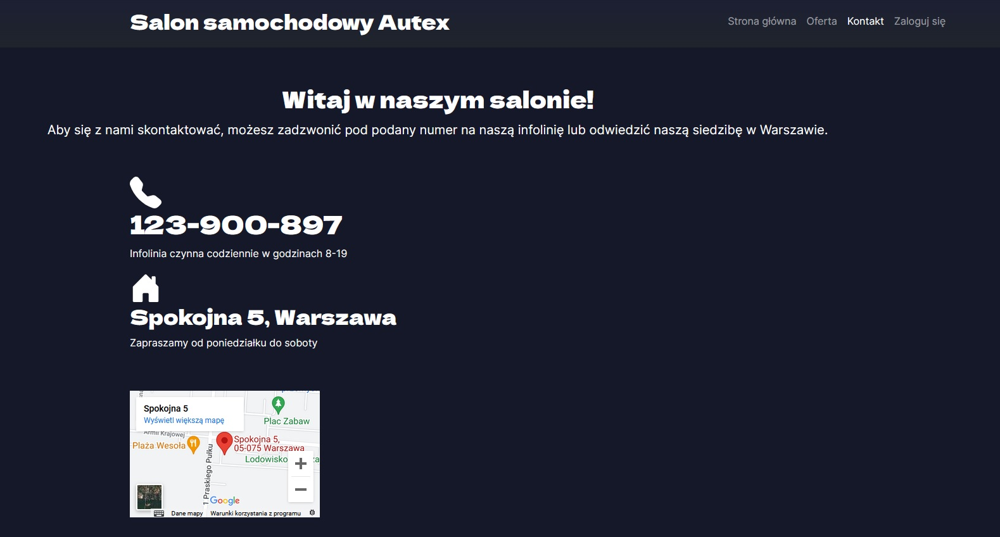
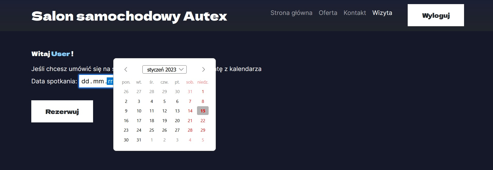
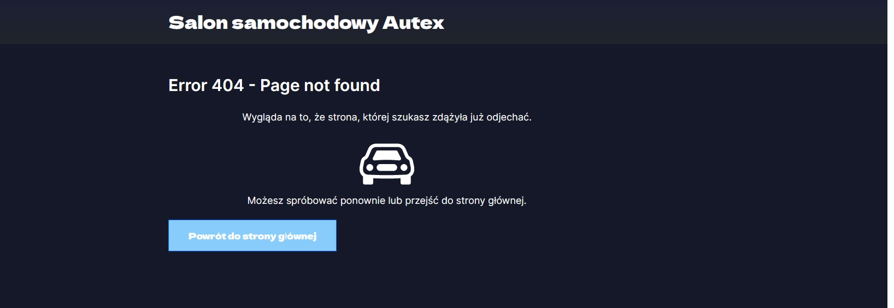
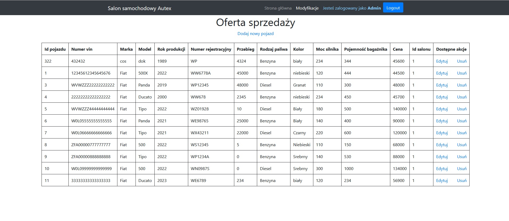

<h1>Projekt Strony Internetowej połączonej z bazą danych dla Salonu Samochodowego</h1>

<h2>Zakres i Cel Projektu</h2>

Projekt skupia się na rozwinięciu wcześniej zaprojektowanej bazy danych poprzez stworzenie aplikacji współpracującej z nią. 
Projekt robiony był w zespole projektowym składającym się z dwóch osób.

Narzędzia i technologie używane w projekcie to:

    Intelij Idea: Zintegrowane środowisko programistyczne do tworzenia aplikacji.
    Oracle Database 19c: Lokalna baza danych wykorzystywana w projekcie.
    SQL Developer: Narzędzie ułatwiające graficzną obsługę bazy danych.
    Java Oracle JDK 17: Wersja Javy używana w projekcie.
    Java Spring: Framework programistyczny do implementacji logiki biznesowej i tworzenia aplikacji.

<h2>Realizacja strony </h2>

Aby zrealizować stronę, konieczne było wykonanie różnych elementów składających się na cały proces:

    Implementacja schematu aplikacji: Wykorzystano Spring Initializer do stworzenia podstawowego szkieletu aplikacji.

    Tworzenie stron w języku HTML: Rozwinięcie aplikacji o interfejs użytkownika, umożliwiający obsługę różnych funkcji.

    Konfiguracja Spring Security: Stworzenie dwóch perspektyw - użytkownika oraz administratora, zabezpieczając dostęp do różnych funkcji.
    (Na ten moment w projekcie użytkownicy nie są dodawani do bazy danych a główne nacisk kładziony był na wcześniej stworzoną w systemie Oracle bazę danych aut)

    Dołączenie bazy danych do projektu: Integracja wcześniej zaprojektowanej bazy danych z aplikacją.

    Dodanie nowych funkcjonalności związanych z bazą danych: Implementacja operacji dodawania, usuwania i modyfikacji danych w bazie danych, związanych z obsługą pojazdów w salonie samochodowym.

<h2>Uprawnienia użytkowników</h2>

    <ul>
          <li>Użytkownik: Po zalogowaniu otrzymuje dostęp do danych o pojazdach oraz może dokonać rezerwacji pojazdu lub umówić się na wizytę w salonie.
          <li>Administrator: Po zalogowaniu otrzymuje dostęp do danych o pojazdach i posiada pełne uprawnienia, umożliwiające modyfikację, dodawanie i usuwanie pojazdów w bazie danych.
    </ul>

<h2>Funkcjonalności aplikacji</h2>

  <ul>
      <li> Umożliwia zalogowanie się, rejestrację klientowi
      <li> Umożliwia przeglądanie ofert salonu, stronę główną jak i zakładkę kontaktu bez zalogowania
      <li> Dla zalogowanych użytkowników umożliwia przęgladanie konkretnych dostępnych aut oraz ich rezerwacje
      <li> Dodanie obsługi typowych błędówy typu 404 itp.
      <li> Administrator po zalogowaniu ma dostęp do bazy danych aut i ma możliwość ich usuwania oraz dodawania 
  </ul>

<h2>Wygląd strony</h2>
    
     
      
         
          
             
              
<h2>Kontekst Biznesowy</h2>

Strona mogłaby by być skierowana dla przedsiębiorstwa z branży samochodowej, a konkretnie dla salonu samochodowego.
Przedsiębiorstwo specjalizuje się w kompleksowej sprzedaży i obsłudze pojazdów.
Salon prowadzi bazę danych wszystkich dostępnych pojazdów oraz ich parametrów, które mogą być potencjalnie interesujące dla klientów.
